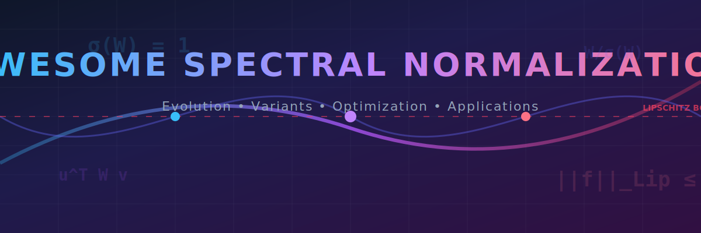
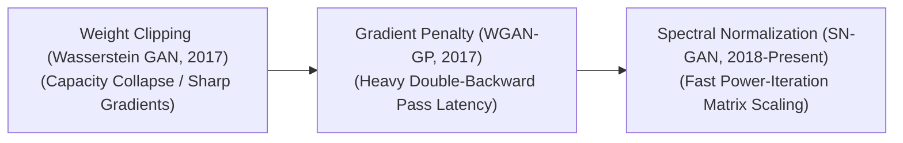

# 🌌 Awesome Spectral Normalization

  

  

    
  

## 📖 Introduction & Overview

**Spectral Normalization (SN)** is a highly effective, hardware-aware regularization technique designed to stabilize the training of deep neural networks, particularly **Generative Adversarial Networks (GANs)**. By enforcing **1-Lipschitz continuity** layer-by-layer, it prevents exploding gradients, mitigates mode collapse, and bounds the sensitivity of network outputs. 

This curated repository tracks the **evolution, functional variants, mathematical optimization schemes, engineering mitigations, and frontier applications** of Spectral Normalization.

---

## 📈 1. The Chronological Evolution

The implementation of Lipschitz-bounding regularizers has transitioned from strict parameter constraints to computationally light power-iteration matrix scaling and multi-axis tensor normalization.

| Method / Evolution Phase | Details | Year | First Paper |
| :--- | :--- | :--- | :--- |
| 🛡️ [The Weight Clipping Precursor](details/weight_clipping.md) | **Concept:** Popularized by the original Wasserstein GAN (WGAN) to enforce 1-Lipschitz continuity. Weights were rigidly clipped to a static, compact hypercube (e.g., $[-0.01, 0.01]$) after every optimization step.  **Limitation:** Severely degraded model capacity, forcing the network to learn overly simplified, smooth functions and preventing it from capturing complex, fine-grained data details. | 2017 | [Wasserstein GAN](https://arxiv.org/abs/1701.07875) |
| ⚡ [The Gradient Penalty Era (WGAN-GP)](details/gradient_penalty.md) | **Concept:** Swapped parameter constraints for activation constraints. It added a regularization term to the loss function that penalized the model if the norm of its gradients strayed away from a target value of 1.0.  **Limitation:** Computationally expensive. Calculating the penalty required a "double-backward" optimization pass, dramatically inflating training time and memory overhead. | 2017 | [Improved Training of Wasserstein GANs](https://arxiv.org/abs/1704.00028) |
| 🚀 [The Spectral Normalization Breakthrough](details/spectral_normalization_breakthrough.md) | **Concept:** Shifted optimization back into the layer parameters but through matrix scaling. It divides each weight matrix by its maximum singular value $\sigma(W)$ at every forward pass step.  **Significance:** Computes $\sigma(W)$ using a highly efficient numerical approximation called the **Power Iteration Method**. This achieved robust Lipschitz bounding with negligible computational overhead, making it the default stability layer for high-resolution generative systems. | 2018 | [Spectral Normalization for Generative Adversarial Networks](https://arxiv.org/abs/1802.05957) |

---

## 🛠️ 2. Core Functional & Tensor Variants

Spectral Normalization has been adapted across distinct tensor configurations to handle variable channel geometries and non-convolutional layer blocks.

| Variant | Mechanism & Details | Year | First Paper |
| :--- | :--- | :--- | :--- |
| 🧊 [Standard 2D Spectral Normalization](details/standard_2d_sn.md) | **Mechanism:** Operates on traditional 2D dense matrix layers. For standard convolutional layers, the 4D weight tensor ($C_{out}, C_{in}, K_h, K_w$) is flattened into a 2D matrix ($C_{out} \times [C_{in} \cdot K_h \cdot K_w]$) before calculating the singular value. | 2018 | [Spectral Normalization for Generative Adversarial Networks](https://arxiv.org/abs/1802.05957) |
| 🌀 [Convolution-Aware / Structural SN](details/convolution_aware_sn.md) | **Mechanism:** Accounts for the physical spatial overlapping properties of convolutional kernels rather than treating them as disconnected matrix rows. It evaluates the spectral norm of the convolution operator itself, offering more precise Lipschitz bounds. | 2018 | [The Singular Values of Convolutional Layers](https://arxiv.org/abs/1811.10143) |
| 🎛️ [Singular Value Bounding (SVB) / Relaxed SN](details/singular_value_bounding.md) | **Mechanism:** Instead of scaling the spectral norm strictly to 1.0, it allows the largest singular value to float freely within a pre-defined, relaxed boundary range (e.g., $[0.5, 1.5]$).  **Pros:** Retains the convergence stability of traditional SN while offering higher flexibility for downstream parameter tuning. | 2017 | [Improving Training of Deep Neural Networks via Singular Value Bounding](https://arxiv.org/abs/1611.06013) |

---

## 🧮 3. Optimization Schemes & Mathematical Approximations

To keep training routines fast, different runtime approximation and matrix decomposition methods are used to track singular values.

| Scheme | Mechanism & Details | Year | First Paper |
| :--- | :--- | :--- | :--- |
| 🔄 [The Power Iteration Method (Online Approximation)](details/power_iteration_method.md) | **Mechanism:** Avoids executing an expensive Singular Value Decomposition (SVD) algorithm ($O(N^3)$ complexity) at every training step. It maintains a pair of randomly initialized scaling vectors ($u$ and $v$). On every forward pass, it runs a single step of matrix-vector multiplication, progressively converging on the true dominant eigenvector.  **Pros:** Drops the compute overhead to $O(N^2)$, running almost instantaneously inside standard PyTorch/TensorFlow graph workflows. | 2018 | [Spectral Normalization for Generative Adversarial Networks](https://arxiv.org/abs/1802.05957) |
| 📐 [Exact SVD Normalization](details/exact_svd_normalization.md) | **Mechanism:** Computes the precise, absolute Singular Value Decomposition of the weight tensors at fixed intervals (e.g., once every 100 training steps).  **Cons:** Highly latent; introduces sudden, sharp computational spikes that disrupt smooth distributed pipeline scaling. | 2017 | [Spectral Norm Regularization for Improving the Generalizability of Deep Learning](https://arxiv.org/abs/1705.10941) |

---

## ⚠️ 4. Production Engineering Challenges & Mitigations

While Spectral Normalization guarantees mathematical stability, it requires deliberate adjustments to prevent capacity bottlenecks.

| Challenge | Problem & Mitigation | Year | First Paper |
| :--- | :--- | :--- | :--- |
| 📉 [The Over-Smoothing / Capacity Reduction](details/over_smoothing_capacity_reduction.md) | **The Problem:** Enforcing a strict 1-Lipschitz bound across *all* network layers simultaneously can over-correct the model, making the network's function landscape overly smooth and dropping the final image sharpness.  **Mitigation:** Implementing **Asymmetric Learning Rates (TTUR - Two-time-scale Update Rule)**, which allows the Discriminator network to run with a faster learning rate than the Generator, balancing the structural constraints of SN. | 2017 | [GANs Trained by a Two Time-Scale Update Rule Converge to a Local Nash Equilibrium](https://arxiv.org/abs/1706.08500) |
| 🥀 [The Spectral Decay Phenomenon](details/spectral_decay_phenomenon.md) | **The Problem:** Over long training durations, the non-dominant singular values of the weight matrix can decay to absolute zero, dropping the effective mathematical rank of the tensor and causing channel redundancy.  **Mitigation:** Layering SN alongside minor **Orthogonal Regularization** parameters to ensure the weight matrix retains full rank and diverse feature separation. | 2018 | [Large Scale GAN Training for High Fidelity Natural Image Synthesis](https://arxiv.org/abs/1809.11096) |

---

## 🚀 5. Frontier Real-World Applications

Spectral Normalization is widely used to enforce stability and robustness across various complex domains.

| Application Area | Impact & Mechanism | Year | First Paper |
| :--- | :--- | :--- | :--- |
| 🎨 [High-Resolution BigGAN & ProGAN Synthesis](details/biggan_progan_synthesis.md) | **Application:** Serves as the core structural layer enabling stable multi-class image generation at high resolutions (e.g., $512 \times 512$ pixels). SN prevents the Discriminator from overpowering the Generator, stopping mode collapse loops. | 2018 | [Large Scale GAN Training for High Fidelity Natural Image Synthesis](https://arxiv.org/abs/1809.11096) |
| 🤖 [Deep Reinforcement Learning Value-Function Approximation](details/deep_rl_value_function.md) | **Application:** Stabilizes value-network evaluations in deep Q-learning (DQN) arrays. Bounding the Lipschitz constant of the network prevents sudden value-estimation spikes from propagating across temporal difference updates. | 2021 | [Towards Deeper Deep Reinforcement Learning with Spectral Normalization](https://arxiv.org/abs/2006.07369) |
| 🛡️ [Adversarial Defense Hardening & Certified Robustness](details/adversarial_defense_certified_robustness.md) | **Application:** Protects vision networks against targeted adversarial attacks (such as FGSM or PGD pixel modifications). Enforcing spectral constraints guarantees that a tiny change in input pixel coordinates cannot trigger an erratic shift in the output classification probability vector. | 2017 | [Parseval Networks: Improving Robustness to Adversarial Examples](https://arxiv.org/abs/1704.08847) |
