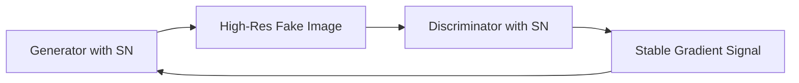

# High-Resolution BigGAN & ProGAN Synthesis

Spectral Normalization is a core component enabling high-resolution image synthesis in large generative models such as BigGAN.

## Application Details
In large-scale GAN training, the discriminator easily overpowers the generator, leading to mode collapse or unstable updates.
By applying Spectral Normalization to the generator and/or discriminator:
- The Lipschitz constant of the discriminator is bounded.
- The generator receives stable, smooth gradient signals, allowing it to scale to high resolutions (e.g., $512 \times 512$ pixels).
- In BigGAN, spectral normalization is applied to both the Generator and the Discriminator, ensuring stable training at massive batch sizes.

## References
- Brock, A., Donahue, J., & Simonyan, K. (2018). [Large Scale GAN Training for High Fidelity Natural Image Synthesis](https://arxiv.org/abs/1809.11096).
- Karras, T., Aila, T., Laine, S., & Lehtinen, J. (2017). [Progressive Growing of GANs for Improved Quality, Stability, and Variation](https://arxiv.org/abs/1710.10196).
