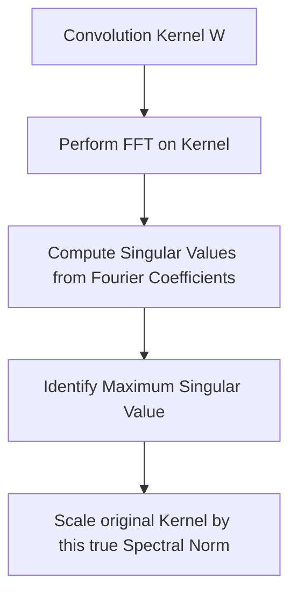

# Convolution-Aware / Structural Spectral Normalization

Convolution-Aware (or Structural) Spectral Normalization addresses the limitation of standard 2D spectral normalization by evaluating the spectral norm of the convolution operator itself, taking into account spatial overlapping, padding, and strides.

## Mechanism
A convolution operation can be represented as a multiplication by a block-Toeplitz matrix. The spectral norm of this large operator is the true Lipschitz constant of the convolutional layer.
Methods like those proposed by Sedghi et al. use the Fast Fourier Transform (FFT) to diagonalize the convolution operator under circular padding. The singular values of the convolution are computed directly from the Fourier transform of the kernels:
$$\text{Singular Values}(W) = \text{FFT}(W)$$
The spectral norm is then the maximum absolute value of the Fourier coefficients.

## Advantages
- Provides **precise and tight** Lipschitz bounds for convolutional layers.
- Avoids the loose bounds of 2D flattening, preventing over-regularization.

## Limitations
- Mathematically complex.
- Exact formulation depends on boundary conditions (e.g., circular vs. zero padding).

## References
- Sedghi, H., Gupta, V., & Atanasov, A. (2019). [The Singular Values of Convolutional Layers](https://arxiv.org/abs/1811.10143).
- Tsuzuku, Y., Sato, I., & Sugiyama, M. (2018). [Lipschitz Margin Training: Scalable Robustness to Adversarial Perturbations](https://arxiv.org/abs/1805.10965).
