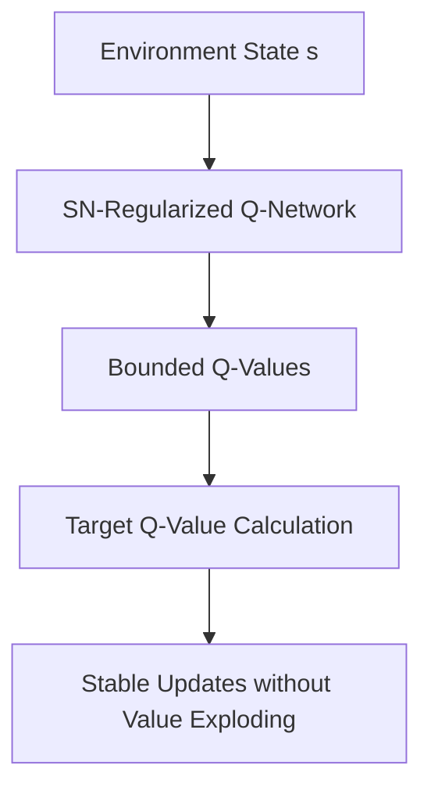

# Deep Reinforcement Learning Value-Function Approximation

Spectral Normalization is applied in Deep Reinforcement Learning (DRL) to stabilize value function estimation and prevent propagation of approximation errors.

## Application Details
In Deep Q-Learning (DQN) and Actor-Critic methods, value updates are computed using bootstrapping:
$$Q(s, a) \leftarrow r + \gamma \max_{a'} Q(s', a')$$
Since the target values are computed using the network itself, small approximation errors can blow up, leading to exploding value estimations and poor policy learning.
By applying Spectral Normalization to the value network:
- The Lipschitz constant of the Q-network is bounded, preventing sudden spikes in Q-values.
- Training is stabilized, enabling the use of deeper neural network architectures in RL.

## References
- Bjorck, J., Gomes, C., & Selman, B. (2021). [Towards Deeper Deep Reinforcement Learning with Spectral Normalization](https://arxiv.org/abs/2006.07369).
- Gogianu, F., Baran, T., & Rusu, A. (2021). [Spectral Normalisation for Deep Reinforcement Learning: An Optimisation Perspective](https://arxiv.org/abs/2105.05191).
