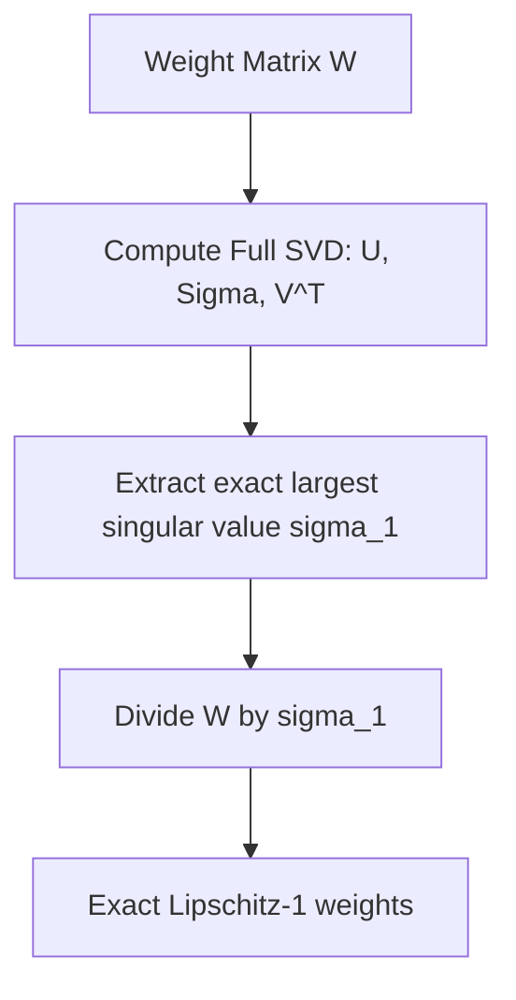

# Exact SVD Normalization

Exact SVD Normalization computes the precise Singular Value Decomposition (SVD) of weight tensors periodically or at every step to enforce hard spectral norm constraints.

## Mathematical Formulation
The singular value decomposition of $W$ is:
$$W = U \Sigma V^T$$
where $\Sigma = \text{diag}(\sigma_1, \sigma_2, \dots)$. The largest singular value $\sigma_1(W) = \sigma(W)$ is the exact spectral norm.
The normalized weights are:
$$W_{\text{Exact}} = \frac{W}{\sigma_1(W)}$$
Unlike power iteration, which approximates $\sigma_1$, this method uses numerical SVD solvers (e.g., Jacobi SVD or QR-based SVD).

## Advantages
- **Precise Bound:** Guarantees that the spectral norm is exactly 1.0 at the time of computation, with no approximation error.

## Limitations
- **High Latency:** Computing SVD has $O(N^3)$ time complexity, which causes severe computational overhead.
- **Spiky Training:** If done periodically (e.g., every 100 steps), it introduces periodic compute spikes, disrupting GPU pipeline scaling.

## References
- Yoshida, Y., & Miyato, T. (2017). [Spectral Norm Regularization for Improving the Generalizability of Deep Learning](https://arxiv.org/abs/1705.10941).
