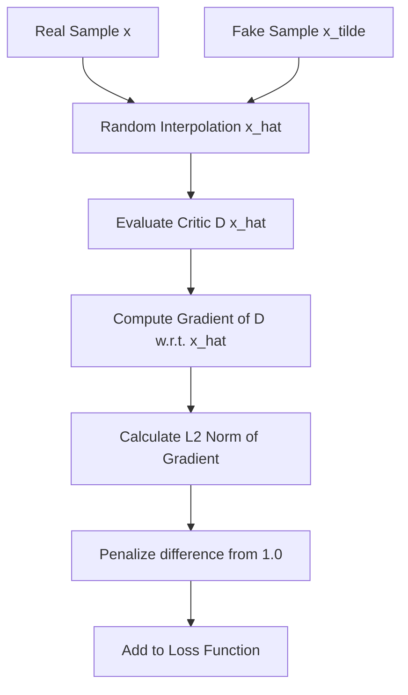

# Gradient Penalty Era (WGAN-GP)

Gradient Penalty was introduced as a direct solution to the issues of weight clipping in WGANs. Instead of parameter constraints, it enforces the 1-Lipschitz property through an activation-based penalty on the loss function.

## Mathematical Formulation
The objective function of WGAN-GP penalizes the deviation of the gradient norm of the critic from 1:
$$L = L_{\text{original}} + \lambda \mathbb{E}_{\hat{x} \sim P_{\hat{x}}} [(\|\nabla_{\hat{x}} D(\hat{x})\|_2 - 1)^2]$$
where $\hat{x} = \epsilon x + (1-\epsilon) \tilde{x}$ is a random interpolation between real samples $x$ and generated samples $\tilde{x}$, and $\lambda$ is the penalty coefficient (typically set to 10).

## Advantages
- **Better Stability:** Avoids the capacity collapse and vanishing/exploding gradients seen with weight clipping.
- **Improved Performance:** Enables high-quality image generation and converges faster.

## Limitations
- **Computational Overhead:** Requires a "double-backward" pass to compute gradients of gradients, which increases memory usage and slows down training by up to 2x.
- **Support Constraint:** The 1-Lipschitz constraint is only enforced along the straight lines between real and fake data points, not globally.

## References
- Gulrajani, I., Ahmed, F., Arjovsky, M., Dumoulin, V., & Courville, A. C. (2017). [Improved Training of Wasserstein GANs](https://arxiv.org/abs/1704.00028).
