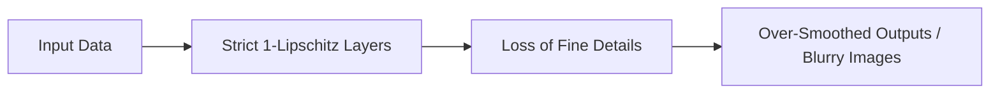
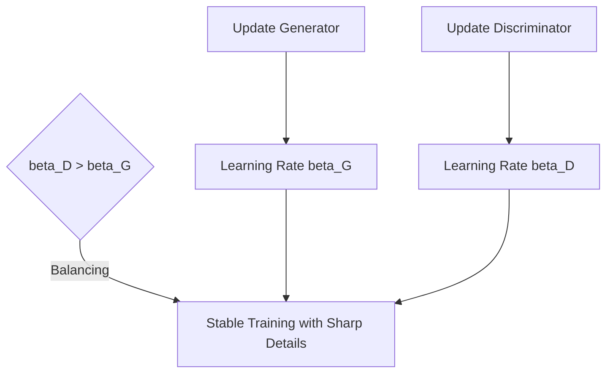

# The Over-Smoothing / Capacity Reduction

Enforcing a strict 1-Lipschitz constraint across all layers simultaneously can over-regularize the network, restricting its representational capacity and resulting in blurry images or simplified decision boundaries.

## The Problem
If every layer is constrained to be 1-Lipschitz, the network cannot learn highly non-linear or steep functions, leading to over-smoothed outputs. In GANs, this prevents the discriminator from distinguishing fine details, reducing the quality of generated images.

## Mitigation: Two-time-scale Update Rule (TTUR)
Instead of loosening the spectral normalization constraint, TTUR balances the power of the Generator ($G$) and Discriminator ($D$) by using different learning rates:
$$\beta_D > \beta_G$$
This allows the discriminator to update faster and maintain its capacity to guide the generator, despite the strict Lipschitz constraints of spectral normalization.

## References
- Heusel, M., Ramsauer, H., Unterthiner, T., Nessler, B., & Hochreiter, S. (2017). [GANs Trained by a Two Time-Scale Update Rule Converge to a Local Nash Equilibrium](https://arxiv.org/abs/1706.08500).
