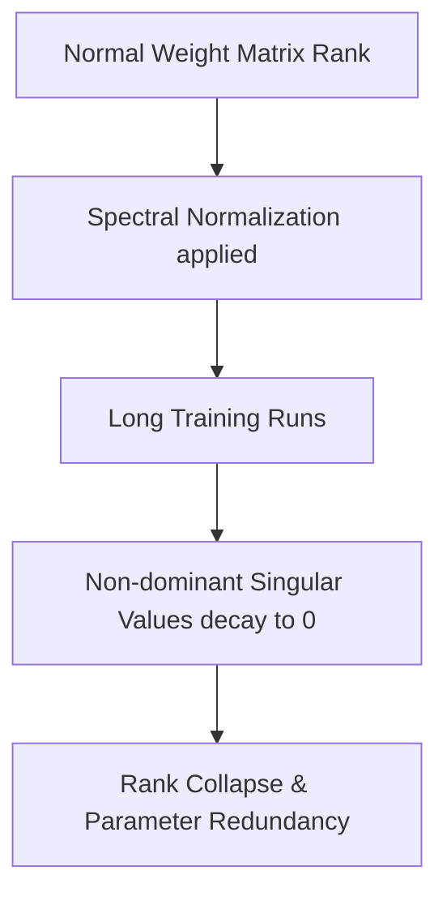
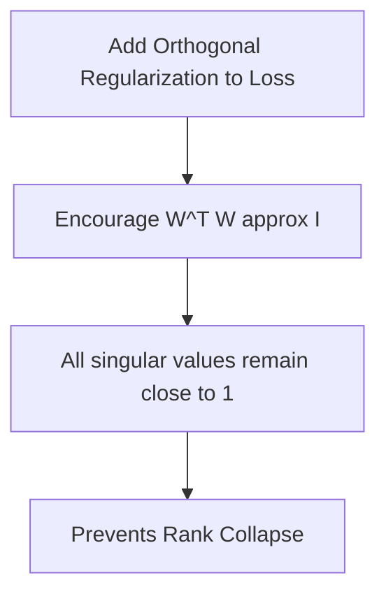

# The Spectral Decay Phenomenon

The Spectral Decay Phenomenon refers to the undesirable behavior where the non-dominant singular values of a weight matrix decay toward zero over long training runs under spectral normalization.

## The Problem
While spectral normalization constrains the largest singular value ($\sigma_1 = 1$), it does not prevent the remaining singular values ($\sigma_2, \sigma_3, \dots$) from decaying. As a result:
$$\text{Rank}(W) \rightarrow 1$$
This rank collapse makes the weight matrix redundant, reducing the effective parameters of the layer and causing representation bottlenecks.

## Mitigation: Orthogonal Regularization
To prevent this, SN is combined with Orthogonal Regularization, which encourages the weight matrix to remain orthogonal (preserving full rank):
$$L_{\text{orth}} = \lambda \|W^T W - I\|_F^2$$
This ensures that all singular values remain close to 1.0, preserving layer capacity.

## References
- Brock, A., Donahue, J., & Simonyan, K. (2018). [Large Scale GAN Training for High Fidelity Natural Image Synthesis](https://arxiv.org/abs/1809.11096).
