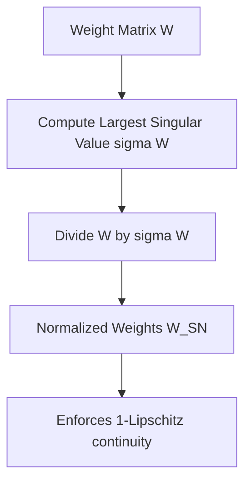

# Spectral Normalization Breakthrough

Introduced by Miyato et al. in 2018, Spectral Normalization (SN) controls the Lipschitz constant of a neural network by scaling the weight matrix of each layer by its spectral norm (largest singular value).

## Mathematical Formulation
For a layer with weight matrix $W$, the spectral norm $\sigma(W)$ is the largest singular value of $W$:
$$\sigma(W) = \max_{h \neq 0} \frac{\|Wh\|_2}{\|h\|_2}$$
Spectral Normalization scales the weight matrix by $\sigma(W)$:
$$W_{\text{SN}} = \frac{W}{\sigma(W)}$$
This forces the Lipschitz constant of the linear mapping to be exactly 1:
$$\|W_{\text{SN}}\|_2 = 1$$

## Advantages
- **Robust Generalization:** Successfully stabilizes GAN training across various architectures.
- **Computational Efficiency:** Using the Power Iteration method, the spectral norm is approximated online with minimal cost.
- **Parameter Space Freedom:** Unlike weight clipping, SN does not restrict parameters to a compact hypercube, preserving representational capacity.

## References
- Miyato, T., Kataoka, T., Koyama, M., & Yoshida, Y. (2018). [Spectral Normalization for Generative Adversarial Networks](https://arxiv.org/abs/1802.05957).
