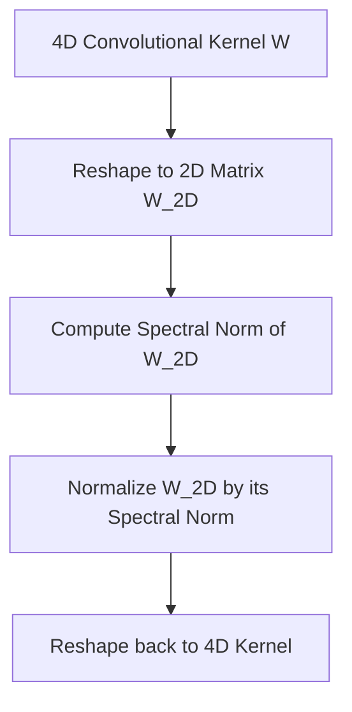

# Standard 2D Spectral Normalization

Standard 2D Spectral Normalization is the implementation of spectral normalization on traditional 2D dense layers and standard convolutional layers by flattening the weight tensors.

## Mechanism
While fully connected layers have 2D weight matrices $W \in \mathbb{R}^{d_{\text{out}} \times d_{\text{in}}}$, convolutional layers have 4D weight tensors $W \in \mathbb{R}^{C_{\text{out}} \times C_{\text{in}} \times K_h \times K_w}$.
To apply spectral normalization, the 4D tensor is reshaped into a 2D matrix:
$$W_{\text{2D}} \in \mathbb{R}^{C_{\text{out}} \times (C_{\text{in}} \cdot K_h \cdot K_w)}$$
Then, the standard power iteration is performed on $W_{\text{2D}}$ to find the largest singular value $\sigma(W_{\text{2D}})$, and the entire 4D tensor is scaled by $\sigma(W_{\text{2D}})$.

## Advantages
- Very simple to integrate into existing deep learning frameworks (e.g., PyTorch, TensorFlow).
- Fast and requires zero additional structural assumptions.

## Limitations
- Treats the convolution operation as a matrix multiplication, ignoring the overlapping spatial effects of convolutional strides and padding, which means it only provides an upper bound, rather than the exact Lipschitz bound of the convolution operator.

## References
- Miyato, T., Kataoka, T., Koyama, M., & Yoshida, Y. (2018). [Spectral Normalization for Generative Adversarial Networks](https://arxiv.org/abs/1802.05957).
